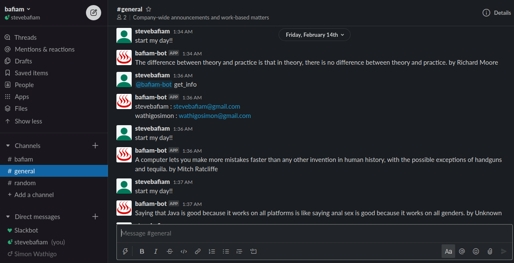

# Slack Bot - Capstone Projects

The bafiam bot is technically a small tweak that brings efficiency to any slack workspace. As a developer, I find myself, in need of crucial members' information. The only way to access this information is to go through the entire member's list. For example, in the case where I have a member's email, am forced to almost check each member's profile and compare their email with the one I have. This is tiring work. On other days, I need a motivation quote to think about and start my day with. The solution to that is to search for one on the net.
The bafiam bot using a single command:

1. One can get a list of all members; all arranged in a list starting with their name and email
2. Get a random quote to start your day

## Screenshots

## Prerequisites

The development environment uses `Ruby`, hence install ruby before proceeding.

- Mac OS - `brew install ruby`

- Linux - `Sudo apt-get install ruby-full`

- windows - Download RubyInstaller [here](https://rubyinstaller.org/), run it, and you are done!

## Installation and set-up

1. Clone the project - git clone`https://github.com/bafiam/bafiam-bot.git`

2. Run `bundle` to get all the gems

3. create a `.env` file

4. Create a Slack Bot using this link - `http://slack.com/services/new/bot`

5. Add the token from the newly created bot to the `.env`

   - SLACK_API_TOKEN=`token_from_slack_api`

## Run the server

1. Run `rackup` to start the bot

2. Navigate to the Slack workspace

3. On one of the channels, invite the bot

## Commands

1. `get_info`==> Return a list of usernames and their corresponding emails

2. `help` ==> Returns a detailed overview description of the bot and commands to use

3. `start my day!!`[typing command] ==> returns a random quote

## Testing

The tests have been implemented using `RSpec`support from `slack-ruby-bot`
To run: Type
`rspec`
on your Terminal to get a report

## Testing the endpoints

The Bot has been tested using two methodologies

1. Unit testing ==> Create a test for the bot application itself

2. Simulation testing ==> Running the bot on slack and evaluating the output

## Built With

This project was developed using:

- slack-ruby-bot ==> Slack framework that does most of the heavy lifting

- celluloid-io ==> Acts as a server;allowing for concurrent processing

- dotenv ==> Enable us to load and run the bot from the config as well as load the environment variables

- rest-client ==> A simple HTTP and REST client to enable us to process the URL and get the data needed.

- RSpec ==> For unit testing though in our case, we will be utilizing the RSpec from the slack-ruby-box and integrating them into our bot.

## Contact

Stephen Gumba - [GitHub profile](https://github.com/bafiam)
